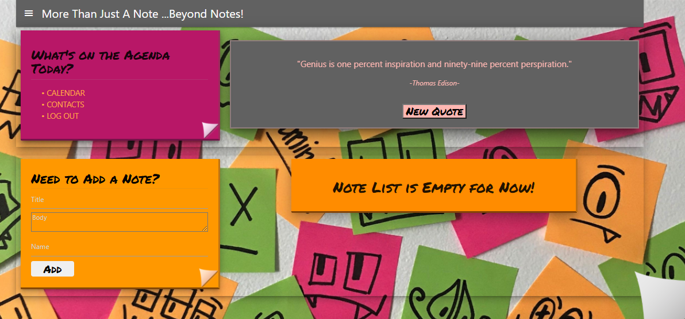

# Beyond Notes! 




## Version:
0.0.1


## Table of Contents:

* [USER STORY](#userstory)

* [VERSION](#version)

* [Installation](#installation)

* [USAGE](#usage)

* [LICENSE](#license)

* [TEST](#questions)

* [QUESTIONS?CONTACT](#questions?contact)


## User Story :
* AS A person with a busy schedule, time management plays an important role. 
* I WANT an application where I can add my thoughts or notes, schedule my events and tasks, and create my own profile to log into 
* SO THAT I can be more productive with my work team, personal schedule, or events. 


## Installation: 
### Use the following instruction to install: 

* App is live on Heroku: [BeyondNotes](https://beyondnotes.herokuapp.com/)

## Usage: 
Beyond Notes is designed for anyone who is looking for an organizational tool to store notes, organize and plan events, and save the information to their profile. 


## License: 


## Tests: 
```Testing not implemented at this time.```

## Questions?Contact:
* Cheryl Daniels [cheryld433](https://github.com/cheryld433)
* Ashley Feese [AFeese](https://github.com/AFeese)
* Malesha Jones [Jones-M12](https://github.com/Jones-M12)
* Travis Lovingood [TravisLovingood](https://github.com/TravisLovingood)

